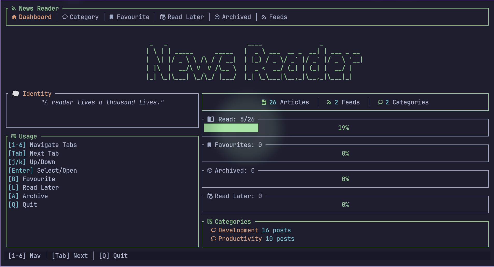

# News Feed TUI (News)

[](https://opensource.org/licenses/MIT)
[](https://github.com/shyamenk/news-feed/issues)
[](https://github.com/shyamenk/news-feed/stargazers)
[](https://github.com/shyamenk/news-feed/network)
[](https://www.rust-lang.org/)
[](https://www.buymeacoffee.com/shyamenk)

A fast, distraction-free, terminal-based RSS news feed reader built with Rust and Ratatui. Designed for developers who want to stay updated without leaving the command line.



## Features

-   **Fast & Lightweight:** Built with Rust for minimal resource usage.
-   **Keyboard-First:** Navigate efficiently using Vim-like keybindings (`j`/`k`).
-   **Offline-Friendly:** Feeds are cached locally in a SQLite database (`news_feed.db`).
-   **Readability:** Articles are rendered as text directly in the terminal using `html2text`.
-   **Organization:** Group feeds by categories, bookmark interesting articles, or save them for later.
-   **Customizable:** Configurable themes and feed sources via `config.toml`.

## Prerequisites

-   **Rust & Cargo:** You need the Rust toolchain installed.
    ```bash
    curl --proto '=https' --tlsv1.2 -sSf https://sh.rustup.rs | sh
    ```
-   **Dependencies:**
    -   `sqlite3` (usually available on most Linux distros, required for `rusqlite` bundled feature or linking).

## Build & Installation

### 1. Clone the repository
```bash
git clone <repository_url>
cd news-feed
```

### 2. Build for Release
Compile the optimized binary:
```bash
cargo build --release
```
The binary will be located at `./target/release/news-feed`.

### 3. Setup `news` Command
To run the application using the custom `news` command, you can create an alias or move the binary to your executable path.

**Option A: Create an Alias (Temporary)**
```bash
alias news='./target/release/news-feed'
```

**Option B: Add to PATH (Permanent)**
Add the following line to your `~/.bashrc` or `~/.zshrc`:
```bash
alias news='/path/to/news-feed/target/release/news-feed'
```
*Replace `/path/to/news-feed` with the actual path.*

**Option C: Install Globally**
Copy the binary to a system directory (requires sudo):
```bash
sudo cp ./target/release/news-feed /usr/local/bin/news
```
Now you can simply run `news` from anywhere!

## Usage

Start the application:
```bash
news
# or
cargo run --release
```

### Keybindings

| Key | Action |
| --- | --- |
| **General** | |
| `q` | Quit the application |
| `Tab` / `BackTab` | Cycle through tabs (Dashboard, Feeds, etc.) |
| `1` - `6` | Switch directly to a specific tab |
| **Navigation** | |
| `j` / `Down` | Move down / Select next item |
| `k` / `Up` | Move up / Select previous item |
| `Enter` | Open selected article / Select category |
| `Esc` | Go back / Cancel input |
| **Actions** | |
| `b` | Toggle **Bookmark** |
| `a` | Toggle **Archive** |
| `l` | Toggle **Read Later** |
| `r` | Reload posts / specific feed |
| `d` | Delete selected feed or post (depending on context) |
| **Feed Management** | |
| `n` / `+` | Add new feed (in Feed Manager) or Category |

### Tabs Overview
1.  **Dashboard:** Overview of recent activity.
2.  **Feeds:** Manage your RSS sources.
3.  **Categories:** Browse feeds grouped by category.
4.  **Read Later:** List of articles saved for later.
5.  **Bookmarks:** Your starred/favorite articles.
6.  **Archived:** History of archived posts.

## Configuration

On the first run, a `config.toml` file is automatically generated in the project root if it doesn't exist.

**Default `config.toml` Structure:**
```toml
[app]
theme = "catppuccin-mocha" # Options: default, catppuccin-mocha
startup_cleanup = false

[ui]
show_ascii_banner = true
default_tab = "all-posts"

[feeds]
urls = [] # Simple list of URLs
# Or structured sources with categories:
[[feeds.sources]]
url = "https://nesslabs.com/feed"
category = "Productivity"

[[feeds.sources]]
url = "https://dev.to/rss"
category = "Technology"
```

## Database
The application uses a local SQLite database (`news_feed.db`) to store feeds, posts, and their states (read, bookmarked, etc.). If you delete this file, the app will recreate it and re-fetch feeds on the next run (losing your saved state).

## Troubleshooting

-   **Config Error:** If the app fails to load, check `config.toml` for syntax errors. Delete it to regenerate the default.
-   **Database Locks:** If the app crashes or hangs, ensure no other instance is writing to `news_feed.db`.